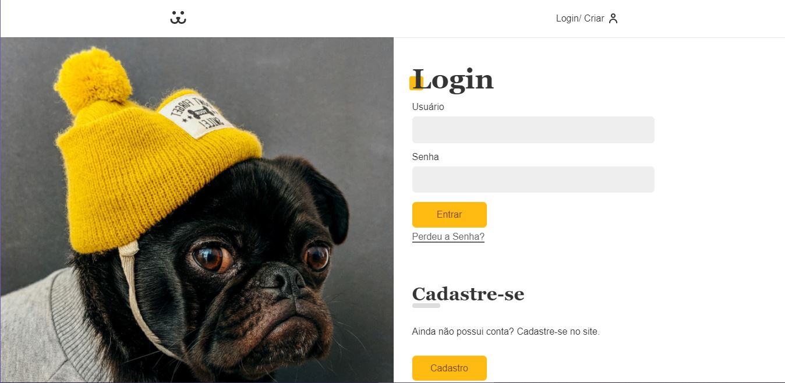

<h1 align="center">
  
</h1>

  <a href="#-tecnologias">Tecnologias</a>&nbsp;&nbsp;&nbsp;|&nbsp;&nbsp;&nbsp;
  <a href="#-projeto">Projeto</a>&nbsp;&nbsp;&nbsp;|&nbsp;&nbsp;&nbsp;
  <a href="#-layout">Layout</a>&nbsp;&nbsp;&nbsp;|&nbsp;&nbsp;&nbsp;
  <a href="#memo-licença">Licença</a>

 

  

 

## Projeto
Esse projeto é resultado do curso de react Js da plataforma origamid.com. 

## 🎨 Layout

 

## 🚀 Tecnologias

Esse projeto foi desenvolvido com as seguintes tecnologias:

- React Js
- Styled-components
- Context-api

## 💻 Projeto

O dogs é uma aplicação semelhante ao instagram tradicional porém voltado para cachorros

## 🔖 Layout

Todo o layout e projeto foi seguido e extraído do curso de react do origamid.com
---

Feito com ♥ by Danrley 

  

